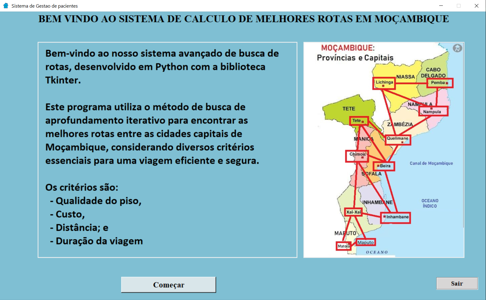

# Busca pela Melhor Rota

## Descrição

Este repositório contém a implementação de uma solução prática de Inteligência Artificial para encontrar a melhor rota entre as cidades capitais de Moçambique. 
O problema é modelado como um grafo, e a solução é desenvolvida em Python, incluindo uma interface de usuário construída com a biblioteca tkinter.

## Objectivo

O objetivo principal deste trabalho é encontrar a melhor rota para viajar entre as cidades capitais de Moçambique, considerando diferentes restrições, como: 
 - Distância;
 - Custo;
 - Tempo de viagem;
 - Estado da estrada;
 - A cidade de origem e destino.

Isso será alcançado por meio de um algoritmo de busca em profundidade iterativa.

## Definição do Problema de Busca
Cada cidade será considerada um estado, e cada estrada que conecta uma cidade à outra será tratada como uma ação.
 - Estado: Cidade
 - Acção: Estrada

### A solução
Será representada pela sequencia de estado e acções, isto é, cidades e as estradas que levaram a melhor rota.

## Recursos:

 - Implementação em Python.  
 - Interface de usuário interativa com tkinter.  
 - Resolução de problemas de roteamento entre cidades capitais moçambicanas.  
 - Abordagem de Inteligência Artificial para otimização de rotas.  
 - Metodo de busca de aprofundamento iterativo  

## Interface
A interface é composta por 3 telas:
 - Tela 1 (inicial): com uma pequena introducao ao programa;
 - Tela 2 (calculo): apresenta a escolha das cidades inicial e final, os critérios, o botão de calculo e a solução;
 - Tela 3 (detalhes): que apresenta mais detalhes da solução.

## Mockup

### Tela 1

### Tela 2

### Tela 3

Sinta-se à vontade para explorar o código-fonte, contribuir ou utilizar este projeto para entender melhor a aplicação de técnicas de IA em problemas práticos de otimização de rotas.
